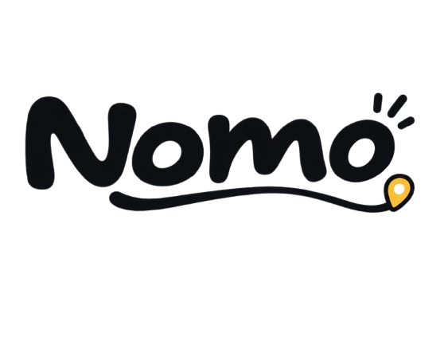

<div align="center">
  
  <h1>NOMO — Personal Memory Map</h1>
  <p><em>NOMO remembers where you've been, not where to go.</em></p>
</div>

---

**NOMO** is a personal, privacy-first, offline-first map of places you've actually experienced. It's not about public reviews or finding the next hot spot; it's a geographic diary of your life, starting with food but ultimately about the memories attached to places.

Think of it as Google Photos × a personal map × a travel diary, but with a fun, clean, personal, and warm aesthetic.

## ✨ Philosophy
- **Your memory, not your review:** No 1-5 star ratings. We track the *vibe*, the *dish*, and the *moment*.
- **Privacy first:** Your metadata stays local. Synced data lives exclusively in your personal Google Drive.
- **Offline first:** Works perfectly without an internet connection. Captures now, syncs when possible.

## 🎨 Visual Identity
NOMO uses a warm, flat palette inspired by natural elements. Strictly no gradients.
- **Terracotta:** `#D96B43`
- **Warm Amber:** `#ECA843`
- **Sage:** `#5B8C67`
- **Deep Charcoal:** `#232528`
- **Cream:** `#FBF8F3`

## 🛠️ Tech Stack & Architecture
- **Language:** Kotlin
- **UI:** Jetpack Compose (Material 3)
- **Local Storage:** Room Database
- **Sync & Background:** WorkManager
- **Map:** MapLibre / OpenStreetMap (OSMDroid)
- **Camera:** CameraX
- **Cloud Storage:** Google Drive API (`drive.file` scope)

### Architecture Flow
```text
Compose UI  →  ViewModel  →  Repository  →  Room (Local)  →  Sync Manager (WorkManager)  →  Google Drive
```

### Drive Structure
NOMO creates and manages a visible `NOMO_Memories` folder in your Drive. It only accesses files it creates.
```text
User's Google Drive
└── NOMO_Memories/
    ├── Photos/
    │   └── <memory-id>.jpg
    └── Memories/
        └── <memory-id>.json
```

## 🚀 Setup Instructions

### 1. Prerequisites
- Android Studio Iguana (or newer)
- JDK 17
- Android SDK 34

### 2. Google Cloud Console Setup
To enable Google Drive sync and Google Sign-In, you must configure a Google Cloud project:
1. Go to the [Google Cloud Console](https://console.cloud.google.com/).
2. Create a new project named "NOMO".
3. Enable the **Google Drive API**.
4. Configure the **OAuth consent screen** (Testing or External). Add the scope: `../auth/drive.file`.
5. Create **OAuth 2.0 Client IDs** for Android:
   - Provide your package name: `com.nomo.app`
   - Provide your debug SHA-1 certificate fingerprint. (You can generate this via `./gradlew signingReport`).
6. Create an **OAuth 2.0 Client ID** for Web application (this is required for Google Sign-In in Android).
7. Copy the **Web Client ID** and place it in your app's configuration (e.g., in a `local.properties` or resource file as required by the auth implementation).

### 3. Build and Run
1. Clone the repository.
2. Open the project in Android Studio.
3. Sync project with Gradle files.
4. Run the app on an emulator or physical device via Android Studio, or using the CLI:
   ```bash
   ./gradlew assembleDebug
   ./gradlew installDebug
   ```

## 📍 Features
- **Map Exploration:** See a personalized map of everywhere you've captured a memory.
- **Offline Capture:** Take photos and write notes completely offline.
- **Drive Sync:** Automatically syncs high-res photos and JSON manifests to your Google Drive when online.
- **Proximity Resurfacing:** Be reminded of past memories when you are within 300m of a previously visited spot.
- **"On This Day":** Throwbacks to memories from the exact same day in previous years.

---
*Built with ❤️ for those who want to remember the moments, not just the places.*
